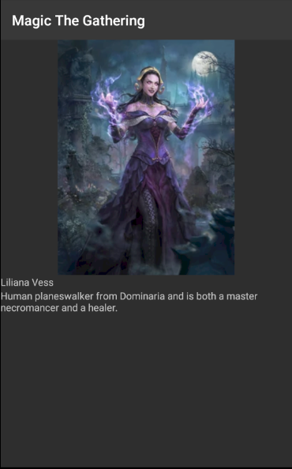

# BJamrowski-aplikacje-mobilne-21666-185ic
## Repozytorium przedmiotu Aplikacje Mobilne

Celem laboratorium bylo stworzenie projektu skladajacego sie z 2 aktywnosci. Pierwsza z nich zawiera kilka przykladowych aktywnosci, jest to aktywnosc typu constraint.

Stosujac widok przewijany mozna umiescic elementy na wiekszej przestrzeni. Po wcisnieciu przyciusku u dolu strony otrzymujemy komunikat typu toast.

Po wcisnieciu w Button zostajemy przekierowani do drugiej aktywnosci. Jest to aktywnosc FrameLayout. Znajduje sie tutaj obraz wyswietlony na calej aktywnosci oraz przycisk z obrazem, ktory
pozwala nam wrocic do poprzedniej aktywnosci.

