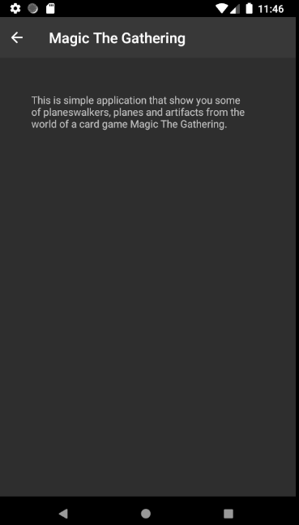

# BJamrowski-aplikacje-mobilne-21666-185ic
## Repozytorium przedmiotu Aplikacje Mobilne

Celem laboratorium bylo stworzenie aplikacji wykorzystujacej kilka poziomow. Dodatkowo aplikacja powinna posiadac wlasny pasek narzedzi oraz aktywnosc,
ktora zawieralaby opis aplikacji.

Podglad glownej aktywnosci. Mamy mozliwosc wyboru jednej z 3 grup.

Po wybraniu grupy zostajemy przeniesieni do widoku listy. Z tego miejsca wybieramy element nas insteresujacy.

Po kliknieciu w element widzimy jego podglad zawierajacy obrazek oraz krotki opis.

Z poziomu glownej aktywnosci mozemy przejsc do aktywnosci zawieracej opis.

