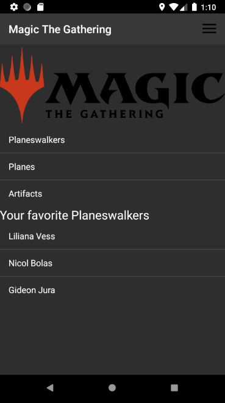
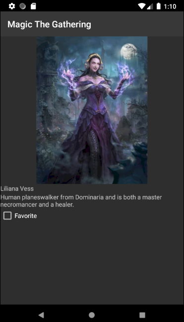

# BJamrowski-aplikacje-mobilne-21666-185ic
## Repozytorium przedmiotu Aplikacje Mobilne

Aplikacja stworzona w ramach tych laboratoriow jest kontynuacja apliakacji z poprzednich zajec. Dzieki wykorzystaniu bazy dancyh
mozemy dodawac wartosci jako ulubione. Dodajac kolejny atrybut mozemy definiowac czy jest on ulubiony czy nie. Nastepnie w glownej 
aktywnosci wyswietlamy te rekordy z bazy danych. Dzieki wykorzystaniu klasy AsyncTask mozliwe jest dzialanie kodu bazy danych 
w watku w tle.

Widok glownej aktywnosci.

Podglad wybranego elementu.

