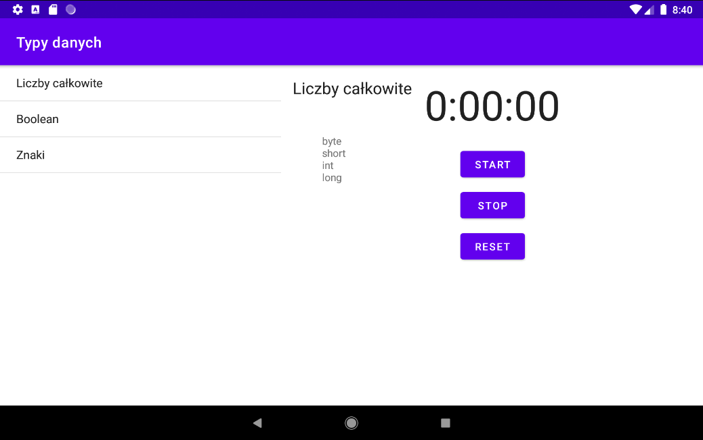

# BJamrowski-aplikacje-mobilne-21666-185ic
## Repozytorium przedmiotu Aplikacje Mobilne

Celem laboratorium bylo stworzenie aplikacji, ktora wykorzystywac bedzie fragmenty. 

Widok listy do wyboru.

Podglad wybranego elementu.

Widzimy w tym miejscu liste z wybranymi elementami oraz stoper z opcja zatrzymania oraz resetu.
