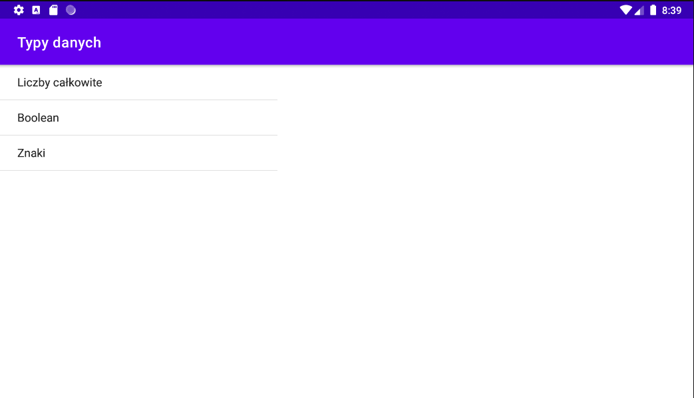

# BJamrowski-aplikacje-mobilne-21666-185ic
## Repozytorium przedmiotu Aplikacje Mobilne

Celem laboratorium bylo stworzenie aplikacji, ktorej zadaniem bedzie przeskakiwanie miedzy aktywnosciami.
Aplikacja zawiera 3 aktywnosci. Z kazdej z nich mozna dostac sie do pozostalych. Aktywnosc 1 zawiera mozliwosc
wyslania tekstu do aktywnosci 2. W ostatniej aktywnosci znajduje sie komunikat.

Aktywnosc 1

Aktywnosc 2

Aktywnosc 3

Metody putExtra oraz getInent zostaly wykorzystane do przesylania tekstu miedzy dwiema aktywnosciami.

